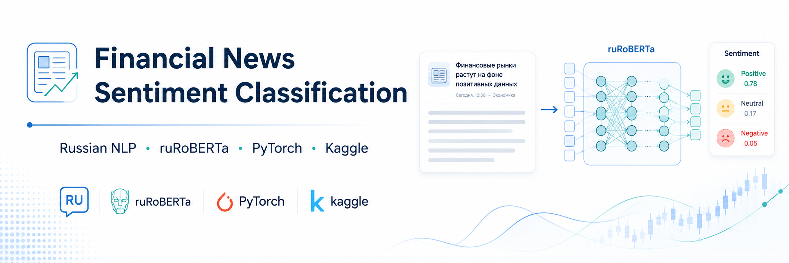
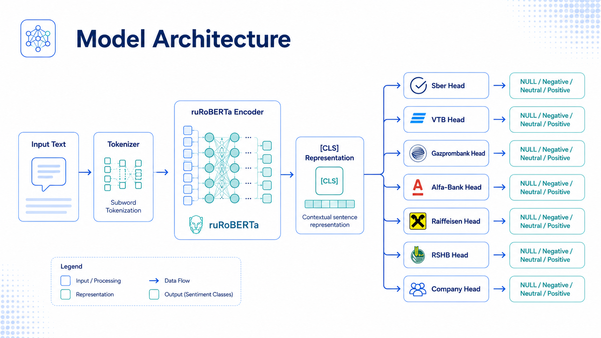
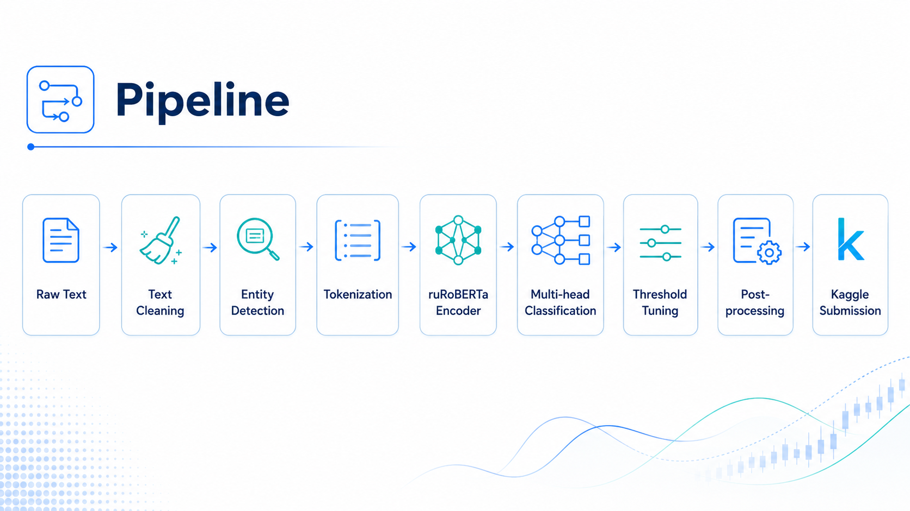

# Financial News Sentiment Classification with ruRoBERTa

<p align="center">
  
  
  
  
  
</p>

<p align="center">
  
</p>

## Overview

This project implements a transformer-based Natural Language Processing solution for financial sentiment classification in Russian-language news headlines and comments.

The task comes from the Kaggle competition **MEPhI M-25 ML Financial News Headlines**. The goal is to identify which financial organization is mentioned in a given text fragment and determine the sentiment expressed toward that organization: **negative**, **neutral**, or **positive**.

The final solution uses `ai-forever/ruRoBERTa-large`, a transformer model for Russian text, combined with cross-validation, class-weighted loss, threshold tuning, and entity-aware post-processing.

Dataset source:
https://www.kaggle.com/competitions/me-ph-i-m-25-ml-financial-news-headlines/data

---

## Table of Contents

* [Overview](#overview)
* [Problem Statement](#problem-statement)
* [Business Context](#business-context)
* [Solution Summary](#solution-summary)
* [Modeling Approach](#modeling-approach)
* [Pipeline](#pipeline)
* [Repository Structure](#repository-structure)
* [Dataset](#dataset)
* [Results](#results)
* [How to Run](#how-to-run)
* [Documentation](#documentation)
* [Skills Demonstrated](#skills-demonstrated)
* [Future Improvements](#future-improvements)
* [Author](#author)

---

## Problem Statement

Financial news and user comments often mention banks, companies, or market events. For financial institutions, it is useful to automatically understand whether public text expresses a positive, negative, or neutral attitude toward a specific organization.

Given a text fragment, the model must answer two questions:

1. Which financial organization is the text referring to?
2. What sentiment is expressed toward that organization?

The target entities include:

* Sber
* VTB
* Gazprombank
* Alfa-Bank
* Raiffeisen
* Russian Agricultural Bank
* Other companies

The final output must follow the Kaggle submission format, where each entity-sentiment pair is represented as a binary column.

---

## Business Context

This type of system can be useful for:

* financial reputation monitoring;
* news analytics;
* customer sentiment tracking;
* investment research;
* risk monitoring;
* market intelligence dashboards.

Instead of manually reading thousands of headlines or comments, an NLP model can help detect sentiment patterns automatically and at scale.

---

## Solution Summary

The final solution is based on a multi-head transformer architecture.

A shared ruRoBERTa encoder extracts contextual representations from the input text. Then, separate classification heads predict the sentiment label for each target organization.

The model predicts four possible classes for each entity:

| Class | Meaning             |
| ----- | ------------------- |
| 0     | No relevant mention |
| 1     | Negative sentiment  |
| 2     | Neutral sentiment   |
| 3     | Positive sentiment  |

After model inference, predictions are converted into the binary format required by the competition.

---

## Modeling Approach

The solution uses a shared ruRoBERTa encoder followed by multiple classification heads. Each head predicts the sentiment label for one target organization.

<p align="center">
  
</p>

The solution includes the following techniques:

| Component         | Description                            |
| ----------------- | -------------------------------------- |
| Transformer model | `ai-forever/ruRoBERTa-large`           |
| Framework         | PyTorch + Hugging Face Transformers    |
| Validation        | 5-fold stratified cross-validation     |
| Loss function     | Class-weighted cross-entropy           |
| Optimization      | AdamW + cosine learning rate scheduler |
| Regularization    | Dropout and early stopping             |
| Metric            | Macro-averaged F1-score                |
| Post-processing   | Entity-aware rule-based correction     |

The evaluation metric is **macro F1-score**, which is especially important for imbalanced classification tasks because it gives equal importance to each target column.

---

## Pipeline

The full machine learning pipeline transforms raw financial text into entity-level sentiment predictions and a valid Kaggle submission file.

<p align="center">
  
</p>

The pipeline consists of the following stages:

1. **Raw text**: news headlines and user comments are loaded from the competition dataset.
2. **Text cleaning**: URLs, emojis, and excessive whitespace are removed.
3. **Entity detection**: rule-based patterns identify mentions of financial organizations.
4. **Tokenization**: text is converted into transformer-compatible token IDs.
5. **ruRoBERTa encoder**: contextual text representations are extracted.
6. **Multi-head classification**: separate classification heads predict sentiment for each target entity.
7. **Threshold tuning**: out-of-fold predictions are used to optimize binary decision thresholds.
8. **Post-processing**: entity-aware rules reduce false positive predictions.
9. **Kaggle submission**: final predictions are exported as `submission.csv`.

---

## Dataset

The dataset is provided by the Kaggle competition:

**MEPhI M-25 ML Financial News Headlines**
https://www.kaggle.com/competitions/me-ph-i-m-25-ml-financial-news-headlines/data

The original files include:

```text
train.csv
test.csv
sample_submission.csv
```

The raw dataset files are not included in this repository. To reproduce the project, download the data from Kaggle and place the files in the expected data directory.

Expected files:

```text
data/train.csv
data/test.csv
data/sample_submission.csv
```

---

## Results

The solution achieved a strong result in the Kaggle leaderboard.

The main performance improvements came from:

* fine-tuning `ai-forever/ruRoBERTa-large`;
* using a multi-head classification architecture;
* applying class-weighted loss for imbalanced labels;
* training with 5-fold cross-validation;
* tuning thresholds on out-of-fold predictions;
* applying entity-aware post-processing rules.

The final evaluation metric was macro-averaged F1-score.

> Note: The exact leaderboard score and screenshot can be added in the `reports/` folder.

---

## How to Run

### 1. Clone the repository

```bash
git clone https://github.com/Luis99fer/financial-news-sentiment-nlp.git
cd financial-news-sentiment-nlp
```

### 2. Install dependencies

```bash
pip install -r requirements.txt
```

### 3. Download the dataset

Download the competition files from Kaggle:

https://www.kaggle.com/competitions/me-ph-i-m-25-ml-financial-news-headlines/data

Place the files in the `data/` directory:

```text
data/train.csv
data/test.csv
data/sample_submission.csv
```

### 4. Run the notebook

Open and run:

```text
notebooks/financial_sentiment_ruroberta_kaggle.ipynb
```

The notebook generates:

```text
submission.csv
```

---

## Documentation

Additional documentation is available in the `docs/` directory:

| Document                        | Description                                    |
| ------------------------------- | ---------------------------------------------- |
| `project_overview.md`           | High-level explanation of the project          |
| `model_pipeline.md`             | Technical explanation of the ML pipeline       |
| `kaggle_competition_summary.md` | Summary of the competition task and evaluation |

---

## Skills Demonstrated

This project demonstrates skills relevant to several technical roles.

### Machine Learning and Data Science

* NLP classification
* Transformer fine-tuning
* PyTorch model training
* Hugging Face Transformers
* Cross-validation
* Macro F1-score optimization
* Class imbalance handling
* Threshold tuning
* Post-processing logic

### Software Engineering

* Clean project structure
* Reusable Python functions
* Modular machine learning workflow
* GitHub repository organization
* Dependency management

### Documentation and Communication

* Clear project documentation
* Structured technical explanations

---

## Author

**Luis Fernando Avalos Guzman**

GitHub: https://github.com/Luis99fer
